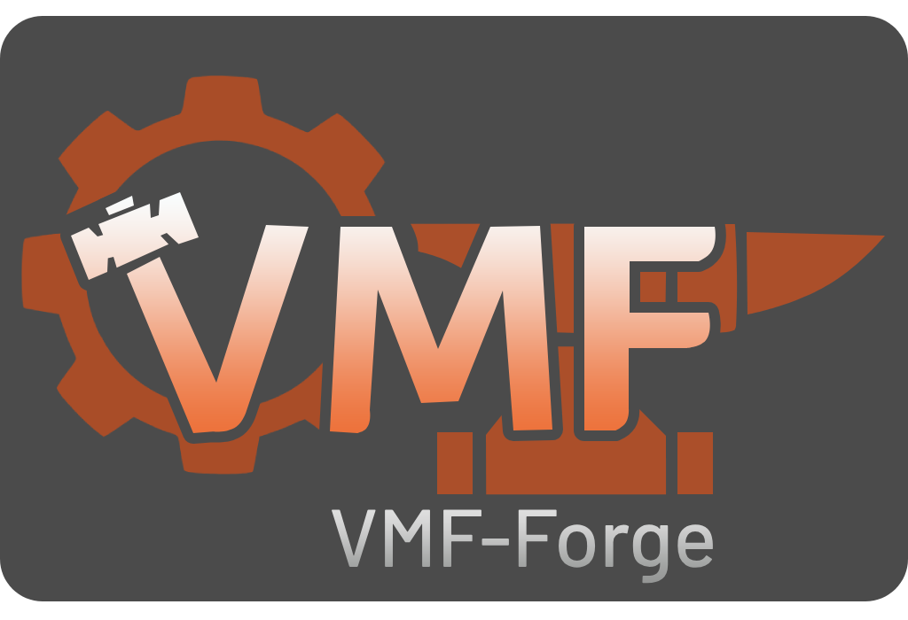

<div align="center">


[](https://crates.io/crates/source-vmf)
[](https://docs.rs/source-vmf)


### `source-vmf` is a Rust library for parsing, manipulating, and serializing Valve Map Format (VMF) files used in Source Engine games. 
</div>

## Features

*   Parses VMF files into convenient Rust data structures.
*   Allows modification of VMF data.
*   Serializes the modified data back into a VMF file.

## Installation

Add `source-vmf` to your `Cargo.toml`:

```toml
[dependencies]
source-vmf = "0.4.0"
```

## Usage Example

```rust
use source_vmf::prelude::*;
use std::fs::File;

fn main() -> Result<(), VmfError> {
    let mut file = File::open("your_map.vmf")?;
    let vmf_file = VmfFile::parse_file(&mut file)?;

    // Access and modify the VMF data
    println!("Map Version: {}", vmf_file.versioninfo.map_version);

    // Find info_player_start entity
    if let Some(player_start) = vmf_file.entities.find_by_classname("info_player_start").next() {
       println!("Found player start: {:?}", player_start);
   }

    // Add a new entity
    let mut new_entity = Entity::default();
    new_entity.key_values.insert("classname".to_string(), "prop_static".to_string());
    new_entity.key_values.insert("model".to_string(), "models/props_foliage/urban_tree001a.mdl".to_string());
    new_entity.key_values.insert("origin".to_string(), "0 0 0".to_string());
    vmf_file.entities.push(new_entity);

    // Save the modified VMF file
    vmf_file.save("modified_map.vmf")?;

    Ok(())
}
```

## Contributing

Contributions are welcome! Please feel free to open issues or submit pull requests.

## License

`source-vmf` is distributed under the terms of either the [MIT license](LICENSE).